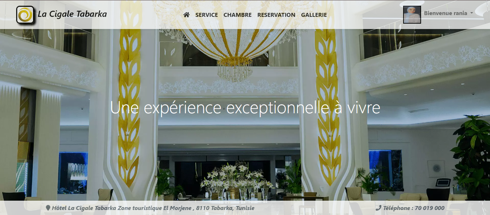

# 🏨 Site Web de Réservation d'Hôtel – La Cigale Tabarka

Bienvenue dans le dépôt du site web **La Cigale Tabarka**, une application de réservation d'hôtel développée en **PHP**, avec une interface moderne en **HTML/CSS**.

---

## 💡 Fonctionnalités

- 🔐 Système de connexion pour les utilisateurs
- 🛏️ Affichage des chambres disponibles
- 📅 Réservation en ligne avec formulaire
- 🖼️ Galerie des lieux
- 📄 Affichage des services disponibles

---

## ⚙️ Technologies utilisées

- **PHP** (backend)
- **MySQL** (base de données)
- **HTML5 & CSS3** (frontend)
- **WAMP** pour l’exécution locale

---

## 📸 Aperçu

